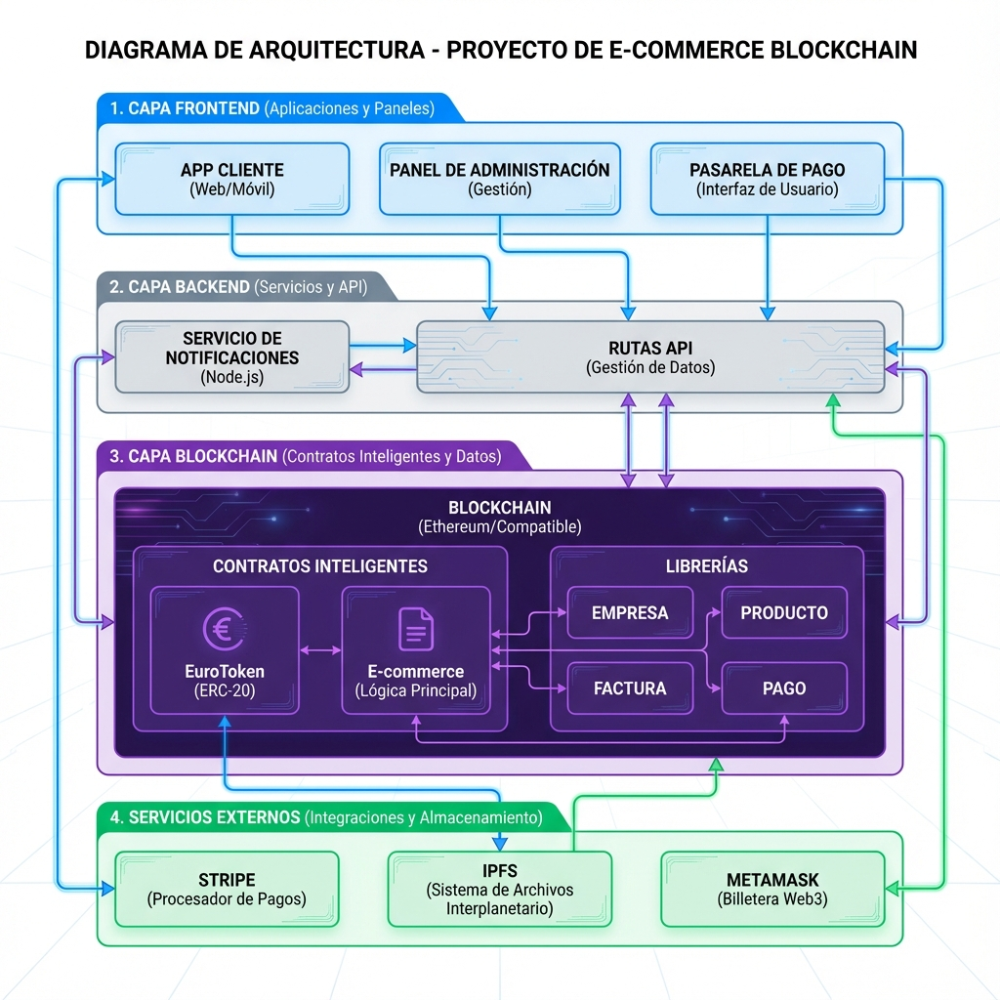
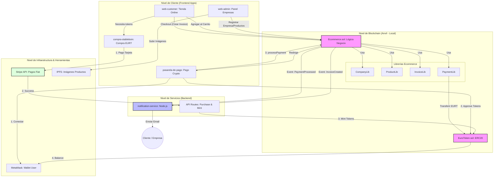

# Arquitectura del Proyecto E-Commerce Blockchain

Este documento detalla la arquitectura técnica y el flujo de datos del sistema completo de e-commerce.

## Diagrama de Arquitectura



### Representación en Código (Mermaid)




---

## 🏗️ Arquitectura del Proyecto

```text
e_commerce/
├── stablecoin/
│   ├── sc/                          # Smart Contract EuroToken
│   │   └── src/EuroToken.sol        # Token ERC20 (6 decimales)
│   ├── compra-stableboin/           # App para comprar tokens con Stripe
│   └── pasarela-de-pago/            # Pasarela de pagos con tokens
├── sc-ecommerce/                    # Smart Contracts E-commerce
│   ├── src/
│   │   ├── EcommerceV2.sol          # Contrato principal (v2 con extensiones)
│   │   ├── LoyaltyNFT.sol           # NFT de fidelidad (Soulbound)
│   │   ├── libraries/               # Lógica modular
│   │   │   ├── ReviewLib.sol        # Ratings y comentarios
│   │   │   ├── MultiCurrencyLib.sol # Soporte multimoneda
│   │   │   ├── AnalyticsLib.sol     # Métricas de ventas
│   │   │   ├── ProductLib.sol       # Gestión de catálogo
│   │   │   └── InvoiceLib.sol       # Facturación on-chain
│   └── script/                      # Scripts de despliegue (Foundry Forge)
├── notification-service/            # Microservicio de notificaciones (Emails)
├── web-admin/                       # Panel de administración
├── web-customer/                    # Tienda online
├── restart-all.sh                   # Script de despliegue y arranque completo
└── ARQUITECTURA.md                  # Documentación de arquitectura
```

---

## Componentes del Sistema

### 1. Capa de Smart Contracts (Blockchain)
*   **`EuroToken.sol`**: Implementación de una Stablecoin (EURT) basada en ERC20 con decimales ajustados (6). Incluye funciones de `mint` controladas por el backend.
*   **`Ecommerce.sol`**: Núcleo de la lógica de negocio. Utiliza librerías modulares para:
    *   **CompanyLib**: Gestión de registros de comercios.
    *   **ProductLib**: Control de stock, precios y catálogo.
    *   **InvoiceLib**: Generación de facturas digitales on-chain.
    *   **PaymentLib**: Procesamiento seguro de transferencias de tokens.

### 2. Capa de Aplicaciones (Frontend)
*   **Web Customer (Puerto 6004)**: Tienda para usuarios finales.
*   **Web Admin (Puerto 6003)**: Panel de control para empresas.
*   **Pasarela de Pago (Puerto 6002)**: Módulo especializado para la ejecución técnica de pagos.
*   **Compra Stablecoin (Puerto 6001)**: Interfaz de intercambio Fiat-Crypto.

### 3. Capa de Servicios
*   **Notification Service**: Microservicio que monitorea eventos `InvoiceCreated` y `PaymentProcessed` para enviar notificaciones por email.
*   **API Gateways**: Manejan la lógica de Stripe y la comunicación segura con la blockchain para el acuñado de tokens.

## Flujo de Datos Principal

1.  **On-ramp**: El usuario compra tokens con tarjeta (Stripe) -> Backend emite tokens en blockchain.
2.  **Shopping**: El usuario navega en `web-customer` -> Crea un `Invoice` en el contrato `Ecommerce`.
3.  **Payment**: Redirección a `pasarela-de-pago` -> Usuario aprueba tokens -> Contrato procesa el pago.
4.  **Notification**: El servicio de notificaciones detecta el pago -> Envía emails de confirmación.