# 🛡️ Solana Auction DApp (Subastas)

Este es un **Marketplace de Subastas Descentralizado** de alto rendimiento construido sobre la blockchain de Solana. Utiliza **Anchor** para la lógica de contratos inteligentes y **Next.js** para una experiencia de usuario fluida y profesional.

---

## 💎 Características de Élite

### 🎨 Diseño Premium 2.0
- **Glassmorphism:** Interfaz translúcida con efectos de desenfoque dinámicos.
- **Tipografía Moderna:** Uso de `Outfit` para encabezados y `Inter` para legibilidad.
- **Micro-interacciones:** Animaciones suaves en hover y estados de carga optimizados.
- **Reporte Técnico Blockchain:** Visualización en tiempo real de PDAs, authorities y estados de escrow directamente en la interfaz.

### ⛓️ Lógica de Negocio en Blockchain
- **Estrategia "Bidder Pocket" 2.0:** Innovador sistema de reembolsos directos entre pujadores con **Buffer de Seguridad (SOL)** para cubrir "Rent" y comisiones, garantizando transacciones 100% exitosas.
- **Sincronización Síncrona (Zero-Delay):** Arquitectura de estado basada en `useMemo` que garantiza que la wallet y el contrato estén siempre en perfecto equilibrio durante cambios de cuenta instantáneos.
- **Read-Only Mode:** Soporte nativo para navegación sin wallet. Los usuarios pueden explorar el mercado y ver detalles técnicos sin necesidad de conexión.
- **Escrow Automatizado:** Los fondos de las pujas ganadoras permanecen seguros en la blockchain hasta la finalización.

---

## 🛠️ Stack Tecnológico

| Componente | Tecnología |
| :--- | :--- |
| **Smart Contract** | Rust + Anchor Framework (v0.32.1) |
| **Frontend** | Next.js 16 (Turbopack) |
| **Styles** | Tailwind CSS v4 + Vanilla CSS |
| **Wallet** | Solana Wallet Adapter (Phantom, Solflare) |
| **Protocol Icons** | Lucide React |

---

## ⚙️ Configuración Local de Solana

Para probar la DApp en tu entorno local, sigue estos pasos esenciales:

### 1. Iniciar el Validador Local
Abre una terminal separada y ejecuta:
```bash
solana-test-validator
```

### 2. Configurar el CLI de Solana
Asegúrate de que tu CLI esté apuntando a localhost:
```bash
solana config set --url localhost
```

### 3. Crear una Wallet de Desarrollo e Inyectar Fondos (Airdrop)
Si no tienes una wallet local creada:
```bash
solana-keygen new --outfile ~/.config/solana/id.json
```
Solicita SOL para poder desplegar e interactuar:
```bash
solana airdrop 2
```

---

## 🚀 Despliegue del Sistema

### Program (Blockchain)
```bash
cd subastas_program
anchor build
anchor deploy
```

### App (Interfaz)
```bash
cd subastas_app
npm install
npm run dev
```
La aplicación estará disponible en [http://localhost:3000](http://localhost:3000).

---

## 🧪 Guía de Uso Rápido

1. **Conexión:** Conecta tu Phantom Wallet y asegúrate de cambiar la red a **Localhost 8899**.
2. **Exploración:** Navega por las subastas existentes incluso sin conectar tu wallet.
3. **Pujar:** Realiza una oferta superior al precio base. El sistema gestionará el reembolso al pujador anterior automáticamente desde tu wallet.
4. **Reporte:** Consulta el "Reporte de Protocolo Blockchain" en la vista de detalle para ver la transparencia absoluta de la subasta.
5. **Cierre:** Una vez finalizado el tiempo, el creador liquida la subasta y recibe el fondo acumulado.

---

---

## 🏗️ Arquitectura del Sistema

La aplicación sigue un patrón de arquitectura desacoplada en tres capas para garantizar seguridad, escalabilidad y una experiencia de usuario fluida:

1.  **Capa On-Chain (Rust/Anchor):** El núcleo de la verdad. Gestiona el estado de las subastas, las validaciones de pujas y el mecanismo de reembolso "Bidder Pocket" mediante transferencias directas de sistema.
2.  **Capa de Servicio (Proxy Pattern):** Ubicada en `subastasProxy.ts`, actúa como un bridge entre la blockchain y la UI, encapsulando la complejidad de las PDAs y la serialización de datos.
3.  **Capa de Interfaz (Next.js/React):** Gestiona la visualización premium y la sincronización síncrona de la wallet mediante un estado global atómico.

---

## 📈 Flujo del Proceso (Bidder Pocket)

El siguiente diagrama visualiza cómo interactúan los actores durante una puja exitosa:

```mermaid
sequenceDiagram
    participant B as Nuevo Pujador
    participant P as Smart Contract (Anchor)
    participant PB as Pujador Anterior
    participant PDA as Subasta Escrow (PDA)

    B->>P: Enviar Instrucción 'crear_puja'
    Note over P: Validar: Subasta Activa?
    Note over P: Validar: Puja > Actual?
    
    rect rgb(30, 41, 59)
    Note right of P: Mecanismo de Reembolso
    P->>PB: Transferencia direct SOL (from B to PB)
    end

    P->>PDA: Actualizar Ganador e Importe
    P->>B: Confirmar Transacción
    Note over B: Éxito: Eres el nuevo líder
```



---

## 📁 Estructura del Proyecto

```text
subastas/
├── subastas_program/          # Lógica On-Chain (Smart Contract)
│   ├── programs/
│   │   └── subastas_program/
│   │       └── src/
│   │           ├── instructions/  # Módulos de lógica procedimental
│   │           ├── state.rs       # Definición de estructuras de datos
│   │           └── lib.rs         # Entrypoint y Routing de cuentas
│   └── Anchor.toml            # Configuración del despliegue
├── subastas_app/              # Interfaz de Usuario (Frontend)
│   ├── src/
│   │   ├── app/               # Next.js App Router (Páginas y Estilos)
│   │   ├── context/           # GlobalContext (Sync de Wallet)
│   │   ├── services/          # SubastasProxy (Abstracción RPC)
│   │   └── constants/         # IDL y Direcciones del Programa
└── README.md                  # Documentación Maestra
```

---

## 📦 Módulos Principales

### 🔴 Subastas Program (Solana)
*   **crear_puja_ix**: Implementa la lógica de "Bidder Pocket", asegurando que el reembolso no pase por cuentas con datos para evitar errores de simulación.
*   **finalizar_subasta_ix**: Gestiona la liquidación de fondos hacia el creador al expirar el tiempo.

### 🔵 Subastas App (Next.js)
*   **GlobalContext**: Centraliza la sincronización de la sesión Anchor, garantizando que el `provider` siempre coincida con la wallet activa.
*   **SubastaDetalle**: El módulo más complejo, que integra el "Reporte de Protocolo" para transparencia total del estado on-chain.

---

Desarrollado con ❤️ para la comunidad de Blockchain Technology Rust.
